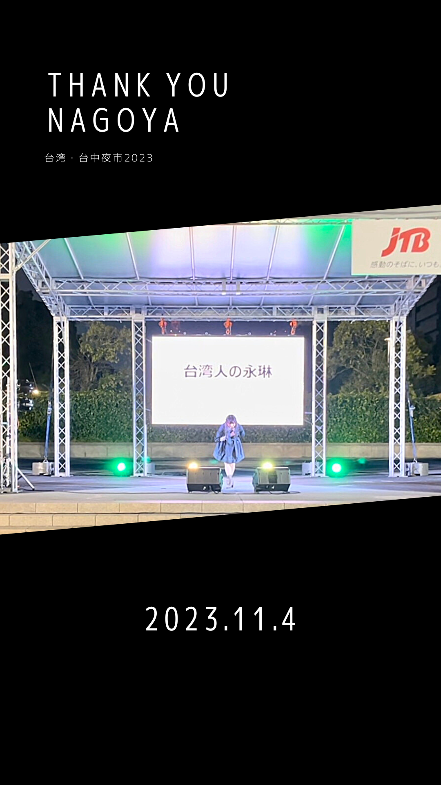
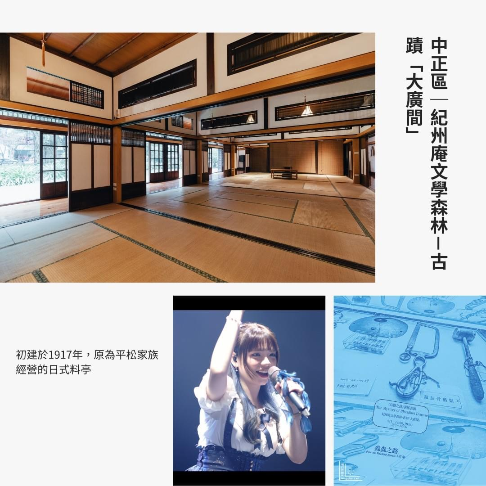



## News

### 初名古屋出演

> 名古屋・栄

感謝 *台湾・台中夜市2023実行委員会* 的邀請。

這次很高興受邀到日本名古屋在「**台湾・台中夜市2023**」的舞臺上演出，在日本難得的連假期間可以演出2個時段！

下午和傍晚各有30分鐘的演出時段，成功把我目前6首原創歌曲都帶上日本的舞臺了。

很難得有這個機會可以收到日本觀衆直接的回饋，非常感謝主辦的邀請與觀衆的支持，謝謝你們喜歡我的歌！

---
### 一日Vtuber

<iframe src="https://www.youtube.com/embed/i-VxEPFifJ0"></iframe>

沒想過永琳會以會動的二次元的形象出現在Vtuber的頻道吧！

錯過想看或是想回味用（半套）V皮和 [Cecily ch. 西西莉](https://youtube.com/@Cecily_KBC?si=kxbNvJwjRlW3foNs) 合作的永琳的話，快去西西莉的頻道看直播的回放吧～

（或點上面的影片也可以直接觀看喔！）

這次直播節目和西西莉聊了很多關於我的二次元形象圖、原創歌曲等等，真的是非常快樂的一段時間。

很感謝西西莉的邀請、感謝收看的觀衆們！希望還能有類似的機會像這樣用不一樣的形式和大家見面。

---
### 2023臺北藝穗節 台湾人の永琳 原創日系音樂演唱會

> 紀州庵文學森林-古蹟「大廣間」

> 「紀州庵」初建於1917年，原為平松家族經營的日式料亭。修復後的古蹟「大廣間」，指的是中間不落柱且開敞的空間，滿載榻榻米香氣的空間，有著交織臺灣人過往記憶與當代省思的《烏腳之謎》在此上演，其沉鬱背景與歷史場地的疊合，更凸顯出臺灣孤兒身世的頓挫與淚光。 **《台湾人の永琳》則以另一特殊的方式，描述了臺灣當代的文化混血特質。受動漫歌曲及J-pop影響的永琳，以日系風味，唱出臺灣女孩的動人心情。**

> *（圖文：臺北表演藝術中心）*

作爲藝穗節上少見的音樂節目，在紀州庵舒適的榻榻米空間舉辦自己的演唱會真的是很難得的機會。

在藝穗節記者會上進行表演、在信義區百貨公司進行藝穗節快閃演出、在臺北表演藝術中心前演出，還有最後自己在紀州庵的表演都是很寶貴的經驗。

原本只是想參加藝穗節辦一場演出，直到活動前夕突然發現我好像辦了一場我的個人演唱會……

很高興有這個榮幸作爲藝穗團隊的一員參加2023的臺北藝穗節，希望自己沒有辜負這次藝穗節的副標題「後浪警報」，有成爲藝穗後浪的一員。

謝謝臺北表演藝術中心、快閃活動負責人亮亮、所有工作人員、還有所有來紀州庵看我的最重要的觀衆們！

#### 活動記錄影片

<iframe src="https://www.youtube.com/embed/7xC8CHFtzIk"></iframe>

---
## Photos & Reels


