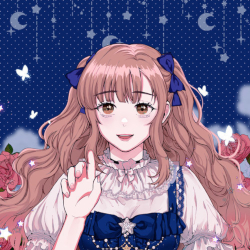
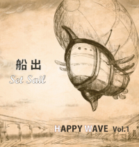



### Songs

|       |       |       |
| :---: | :---: | :---: |
|  | <a href="https://www.soundscape.net/a/41364" target="_blank" rel="noopener noreferrer">台湾人の永琳 5th Single 墨色海洋</a> | <a href="https://docs.google.com/document/d/e/2PACX-1vTjnQ174PVztlAoOlMWNOUaTORe5fSJdX-yMXKlj43a7K-SYrDgjHfQII6_LbNdmFA15GDoOe0VszF_/pub" target="_blank" rel="noopener noreferrer">歌詞</a> |
|  | <a href="https://www.soundscape.net/a/31256" target="_blank" rel="noopener noreferrer">台湾人の永琳 4th Single 命は短し、お酒飲もう</a> | <a href="https://docs.google.com/document/d/e/2PACX-1vSKmamdybliDoeA1O9b2ASKZEwhGyrklDSZPD3Pcmy_s0XBHAv5WCRRPk7Xeyfxr1srOhYDhC3XvDJb/pub" target="_blank" rel="noopener noreferrer">歌詞</a> |
|  | <a href="https://www.soundscape.net/a/26082" target="_blank" rel="noopener noreferrer">台湾人の永琳 3rd Single 一個人的畢業歌</a> | <a href="https://docs.google.com/document/d/e/2PACX-1vQx7ZH-fum4l6_mMU06VaT-Xe4nKUl6kDjrKEziUE5m5qivi1s3haIM_3EEJqBJI2Lw25liflivMboj/pub" target="_blank" rel="noopener noreferrer">歌詞</a> |
|  | <a href="https://www.soundscape.net/a/21065" target="_blank" rel="noopener noreferrer">台湾人の永琳 2nd Single Do You ワナ Touch Me</a> | <a href="https://docs.google.com/document/d/e/2PACX-1vTSJ5zLX-Lge0naOpr8bKoYfzp_poGPGSiwEQmMyoeQ7th-Y-pJJ-nKqxs2GGu-yUlnDK--Ivdg1VNm/pub" target="_blank" rel="noopener noreferrer">歌詞</a> |
|  | <a href="https://www.soundscape.net/a/16698" target="_blank" rel="noopener noreferrer">台湾人の永琳 1st Single 生まれ変わる</a> | <a href="https://docs.google.com/document/d/e/2PACX-1vTSdbYT29alt0jSFXWw9gdIhjEgB6gNBV5vq6T_w6BnkGfcslg5PRlgVTi9L23qu4nRAcOSS4gUmJLL/pub" target="_blank" rel="noopener noreferrer">歌詞</a> |
|  | HAPPY WAVE Vol.1 船出 Set Sail 03. 光を追う | <a href="https://docs.google.com/document/d/e/2PACX-1vT6Z-5hKr8aZoxAsZZY393AZe8N4Z4dS9-UVzAdfWo2ZXyTbfbJKAADkxSr12x8rk6t2vUtvhlAJ8g5/pub" target="_blank" rel="noopener noreferrer">歌詞</a> |

###  Stories

---
#### 墨色海洋

「不會啦，你想太多了，事情沒有那麼糟」

「看開一點就好啦，總會有辦法解決的」

「你就是過得太輕鬆了，才會有時間想這些有的沒的」

 

不，他們不懂。

 

不懂我如何掙扎，試圖走進正常人的世界。

不懂我如何拼命追趕，努力成為理想中的樣子。

不懂我在多少個夜晚，無數次因為對自己的厭惡而憤怒哭泣。

 

現在才發現，

原來我應該做的是學著去接受。

 

即使終究無法喜歡自己，

還是可以學習原諒我的過往，

接受內心的黑暗，

擁抱我滿身斑駁的傷痕。

---
#### 命は短し、お酒飲もう

你在陰暗的森林裡迷路了。

 

筋疲力盡時，突然發現遠處隱約透著光亮，

急忙走近一看，竟發現有一群人在營火旁唱歌跳舞、飲酒作樂。

 

盛情難卻，你答應了邀約，加入他們的狂歡。

酒一杯接著一杯，歌一首接著一首，

你忘記自己正在尋找返回的路。

 

酒精的作用之下，迷茫的意識當中，

你發現周圍的人似乎形體漸漸在改變，

他們不是你所認知的人類……

 

頓時恐懼油然而生，但你已無力掙扎。

 

.

.

.

 

反正人生苦短，不如回想起自己本來的樣貌。

---
#### 一個人的畢業歌

隨著連日的梅雨，畢業季來臨了。

看同學們流著眼淚珍重再見，你只覺得荒唐可笑。

 

老師討厭你，同學無視你，

你開始懷疑自己是否沒有價值，

才會在這個大家團結一致地讚不絕口，

所謂溫馨快樂的環境裡，

只有你被劃分在任何一個群體之外。

 

其實，這座廣大且孤單的城市裡，

一定會有屬於你的一片天地。

畢業代表著出發，就從這一天開始，

前進，並且不再懷疑自己。

---
#### Do You ワナ Touch Me

用最帥氣的歌曲，唱最甜美的歌詞。

充滿自信地宣告，你會不知不覺被我擊中。

---
#### 生まれ変わる

雖然現在的我還不能說是有什麼顯著的成就，

但希望未來不論走到哪裡，都不要忘記這一份持續前進的心情。
