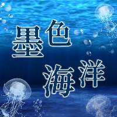



## Singles

| | *※ Click Cover -> MV* | *※ Click Title -> Streaming* | |
| :---: | :---: | :---: | :---: |
| 7th Single |   （尚未發行）   | 魂の探求行 ～Retrieving True Self | [歌詞](https://docs.google.com/document/d/1j-n-cCxmiTHBg4-i0kDEnJtRTuXOUnwNbEODjMLV5k8/pub) |
| 6th Single |  | [恋の遊園地](https://www.soundscape.net/a/42620)   [Live Dance Video](https://youtu.be/5y54OF12Pu0) | [歌詞](https://docs.google.com/document/d/e/2PACX-1vQvU80ScETkvdbYgpnG_eyLm2LN6QQopxdL0YyCiSMncq8r6IlhvdtYptd005suVskpKl7EVLHeZYQb/pub) |
| 5th Single |  | [墨色海洋](https://www.soundscape.net/a/41364) | [歌詞](https://docs.google.com/document/d/e/2PACX-1vTjnQ174PVztlAoOlMWNOUaTORe5fSJdX-yMXKlj43a7K-SYrDgjHfQII6_LbNdmFA15GDoOe0VszF_/pub) |
| 4th Single |  | [命は短し、お酒飲もう](https://www.soundscape.net/a/31256) | [歌詞](https://docs.google.com/document/d/e/2PACX-1vSKmamdybliDoeA1O9b2ASKZEwhGyrklDSZPD3Pcmy_s0XBHAv5WCRRPk7Xeyfxr1srOhYDhC3XvDJb/pub) |
| 3rd Single |  | [一個人的畢業歌](https://www.soundscape.net/a/26082) | [歌詞](https://docs.google.com/document/d/e/2PACX-1vQx7ZH-fum4l6_mMU06VaT-Xe4nKUl6kDjrKEziUE5m5qivi1s3haIM_3EEJqBJI2Lw25liflivMboj/pub) |
| 2nd Single |  | [<small>Do You ワナ Touch Me</small>](https://www.soundscape.net/a/21065) | [歌詞](https://docs.google.com/document/d/e/2PACX-1vTSJ5zLX-Lge0naOpr8bKoYfzp_poGPGSiwEQmMyoeQ7th-Y-pJJ-nKqxs2GGu-yUlnDK--Ivdg1VNm/pub) |
| 1st Single |  | [生まれ変わる](https://www.soundscape.net/a/16698) | [歌詞](https://docs.google.com/document/d/e/2PACX-1vTSdbYT29alt0jSFXWw9gdIhjEgB6gNBV5vq6T_w6BnkGfcslg5PRlgVTi9L23qu4nRAcOSS4gUmJLL/pub) |

###  Stories

---
#### 恋の遊園地

戀愛是遊戲，是戰爭，是樂趣，\
不用想那麼多，一切都是玩玩而已。

明明我一直都是這樣想的，\
為什麼現在卻忘不了你？

我知道我也不是你命中註定的那個人，\
但我只想跟你快樂地度過今晚。

---
#### 墨色海洋

「不會啦，你想太多了，事情沒有那麼糟」\
「看開一點就好啦，總會有辦法解決的」\
「你就是過得太輕鬆了，才會有時間想這些有的沒的」

不，他們不懂。

不懂我如何掙扎，試圖走進正常人的世界。\
不懂我如何拼命追趕，努力成為理想中的樣子。\
不懂我在多少個夜晚，無數次因為對自己的厭惡而憤怒哭泣。

現在才發現，\
原來我應該做的是學著去接受。

即使終究無法喜歡自己，\
還是可以學習原諒我的過往，\
接受內心的黑暗，\
擁抱我滿身斑駁的傷痕。

---
#### 命は短し、お酒飲もう

你在陰暗的森林裡迷路了。

筋疲力盡時，突然發現遠處隱約透著光亮，\
急忙走近一看，竟發現有一群人在營火旁唱歌跳舞、飲酒作樂。

盛情難卻，你答應了邀約，加入他們的狂歡。\
酒一杯接著一杯，歌一首接著一首，\
你忘記自己正在尋找返回的路。

酒精的作用之下，迷茫的意識當中，\
你發現周圍的人似乎形體漸漸在改變，\
他們不是你所認知的人類……

頓時恐懼油然而生，但你已無力掙扎。

.\
.\
.

反正人生苦短，不如回想起自己本來的樣貌。

---
#### 一個人的畢業歌

隨著連日的梅雨，畢業季來臨了。\
看同學們流著眼淚珍重再見，你只覺得荒唐可笑。

老師討厭你，同學無視你，\
你開始懷疑自己是否沒有價值，\
才會在這個大家團結一致地讚不絕口，\
所謂溫馨快樂的環境裡，\
只有你被劃分在任何一個群體之外。

其實，這座廣大且孤單的城市裡，\
一定會有屬於你的一片天地。\
畢業代表著出發，就從這一天開始，\
前進，並且不再懷疑自己。

---
#### Do You ワナ Touch Me

用最帥氣的歌曲，唱最甜美的歌詞。\
充滿自信地宣告，你會不知不覺被我擊中。

---
#### 生まれ変わる

雖然現在的我還不能說是有什麼顯著的成就，\
但希望未來不論走到哪裡，都不要忘記這一份持續前進的心情。
